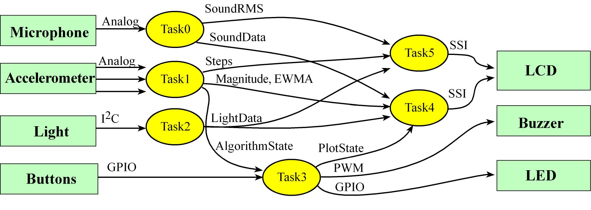

# Lab 1: Introduction to I/O

Lab achieved with a score of 100%

## Purpose

The Lab 1 starter project using the LaunchPad and the Educational BoosterPack MK-II (BOOSTXL-EDUMKII) is a fitness device. It inputs from the microphone, accelerometer, light sensor and buttons. It performs some simple measurements and calculations of steps, sound intensity, and light intensity. It outputs data to the LCD and it generates simple beeping sounds. 

Your assignment is to increase the rate of Task0 from 10 to 1000 Hz, while maintaining the existing rates of the other five tasks. More specifically, we are asking you to modify the main program, such that

- Task0: desired time between executions is 1000µs (starter code runs at 100,000µs)
- Task1: desired time between executions is 100,000µs
- Task2: desired time between executions is 1,000,000µs
- Task3: desired time between executions is 100,000µs
- Task4: desired time between executions is 100,000µs
- Task5: desired time between executions is 1,000,000µs

You can obtain full score if your system runs within 5% of these specifications.

*Data flow graph of Lab 1*.

## Completed files

`Lab.c`- main file
